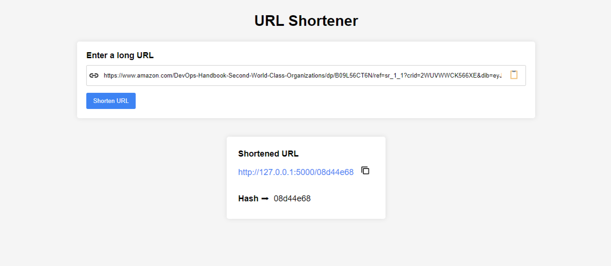

# URL Shortener
## About
A URL Shortener app that allows a client to submit a long URL and shorten it.  
Example:  
https://www.amazon.com/DevOps-Handbook-Second-World-Class-Organizations/dp/B09L56CT6N/ref=sr_1_1?crid=2WUVWWCK566XE&dib=eyJ2IjoiMSJ9.tU_xGHE5-CQjKnzx0OYS3n4nE2SC4S657szU0zcpkioyBaJlnDvqW3srUm5EsqOmBGy4ie8YxBUXinR7mij8unC5EHOEjCthdXe2Br0b9FEOgfSLA3pQvxUihTe3Au3fOTgVwqNQ3W7zRKFJEzKpuwsAskMotE1uOhGI3J6pTM-hRZFE5EbAY8D8GvUMbPPl1jxyc_UrphltYbg2zV4v-I4jN1FxbFTLrT0YwtpVoOQ.Fqd97XzPAjZPjEI7Gffn5GEQRH9mAYdNxPok5ZblKNA&dib_tag=se&keywords=devops&qid=1708471444&s=books&sprefix=devops%2Cstripbooks-intl-ship%2C88&sr=1-1

Would be shortened to: http://127.0.0.1:5000/08d44e68

Install dependencies by running:  
&emsp; &ensp;  pip install -r requirements.txt

To run the app, simply execute the following commands in a terminal  
&emsp; &ensp;  cd server/  
&emsp; &ensp;  flask run  

<h4>Set up redis DB (Note: this project is only available locally)</h4>
<h5>Windows</h5>
Follow the instructions on this page: https://redis.io/docs/install/install-redis/install-redis-on-windows/
<h5>Linux</h5>
Follow the instructions on this page: https://redis.io/docs/latest/operate/oss_and_stack/install/install-redis/install-redis-on-linux/  
 
Make sure the redis server is started by executing the following command:  
&emsp; &ensp;  redis-server 
 
Note: the delete route is not accessible through the web UI. You need to use tools to make external requests (e.g. via curl) to access it.
